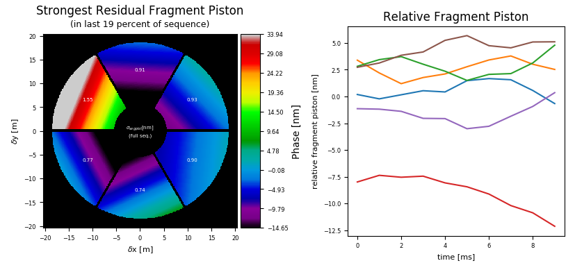

============================
Pupil Fragmentation Analyzer
============================

Description
===========

The fragmentation analyzers looks, as the name implies, at pupil fragments individually.
Pupil fragments are sections of the telescope pupil that are not connected to one another and thus form individual
fragments or "islands". This fragmentation can give rise to two kinds of effects in adaptive optics, the

Island effect
  arises when the AO loop itself by numerical errors combined with the reconstructor's inability to provide accurate information on the wavefront's piston offset introduces independent piston terms for each fragment. The other possibility is the

Low-wind effect
  originally dubbed "Mickey Mouse effect" due to the shape of the PSF it produces. Here, the difference in temperature between the air passing at low wind speeds across the secondary support structure, and the support itself causes physical phase differences between adjacent fragments. Again combined with the
  reconstructor's inability to yield accurate piston information, these do not get corrected.

The result of both is almost similar, but it is important to note that the first is purely of numerical origin, while the second has a physical origin.
Few AO simulations accurately simulate the low-wind effect, it usually needs to be introduced specifically.

While the effect of the two is similar, it is not identical: The low-wind effect does usually not introduce pure piston terms, but a jump of the phase at a support spider which then flattens out again after a couple of metres, resulting in an additional  tilt across the affected fragment (see e.g. Fig. 1 in [Sauvage+2016]_).

In any case tip-tilt terms remain closely connected to pupil fragmentation, as a global tilt across the pupil will also cause piston terms of fragments to differ, particularly along the tilt gradient.  Vice versa, a real piston difference of fragments opposing each other in the pupil (may) appear as a global tilt.

Finding fragments
-----------------

Analyzing pupil fragments is an integral part of AOSAT,  the fragments are thus identified during the setup of any analysis run, no matter which particular analyzer is used afterwards. Fragments are found by means of the `scipy.ndimage.label <https://docs.scipy.org/doc/scipy/reference/generated/scipy.ndimage.label.html>`_ function, and are contained in the setup dictionary's ``fragmask`` element.

  Labeled apertures of some well-known telescopes / projects.

Analyzing fragments
-------------------

In each time step, ``frg_analyzer`` determines the piston and tip-tilt terms of each individual fragment.  Piston is determined simply as the mean of the phase across the fragment.  Fragmental (i.e. global across the fragment) tip-tilt is determined by a least squares fit of a tilted but otherwise flat plane to the wavefront inside the fragment.

.. code-block:: python

  for i in range(num_fragments):
    ## tilt from WF
    ## wfrag contains the valid indeces for each fragment
    C,_,_,_ = np.linalg.lstsq(self.A[i], frame[self.wfrag[i]])
    self.ttxt[self.ffed,i]    = C[0]
    self.ttyt[self.ffed,i]    = C[1]
    self.pistont[self.ffed,i] = C[2]

Piston, tip, and tilt of each fragment are stored for each time step.

Upon completion, i.e. when `finalize()` is called, the analyzer computes the mean, and the standard deviation on each of the stored time series.

Plot captions
=============

When called on its own, or on a figure with sufficient available subplot space, ``frg_anaylzer.makeplot()`` will produce two figures like so:

The figure caption for the left image would be:

*Pupil fragmentation  analysis.  The color image gives the piston and tilt of the frame with the largest span of piston values across fragments during the last
19% (xx s) of the sequence. The numbers in the fragments give the piston value standard deviation (in nm) across the full sequence for the corresponding fragment.*

Note the length of the sequence to search for the worst piston occurrence can be altered by use of the ``tile`` argument in the call of ``frg_analyzer.finalize(tile=0.8)``.

The figure caption for the right image would be:

*Piston term of individual pupil fragments over time*

It is planned to provide the temporal power spectrum of piston terms as an inset in a forthcoming version.

Resulting properties
====================

`frg_analyzer` exposes the following properties after :meth:`frg_analyzer.finalize()` has been called:

.. csv-table:: frg_analyzer porperties
  :widths: 1, 3, 5
  :header-rows: 1
  :delim: ;

  Property; type; Explanation
  :attr:`~aosat.analyzers_.frg_analyzer.frg_analyzer.piston`; 1D ndarray (float) of length n_fragments ; Array holding the mean piston value for each pupil fragment (in nm).
  :attr:`~aosat.analyzers_.frg_analyzer.frg_analyzer.dpiston`; 1D ndarray (float) of length n_fragments ; Array holding the standard deviation of the piston value for each pupil fragment (in nm).
  :attr:`~aosat.analyzers_.frg_analyzer.frg_analyzer.pistont`; 2D ndarray (float) of shape (n_frames, n_fragments).;   Array holding individual piston values for each frame in the sequence.
  :attr:`~aosat.analyzers_.frg_analyzer.frg_analyzer.ttx`; 1D ndarray (float) of length n_fragments ; Array holding mean tip deviation for each fragment (in mas).
  :attr:`~aosat.analyzers_.frg_analyzer.frg_analyzer.dttx`; 1D ndarray (float) of length n_fragments ; Array holding the standard deviation of tip deviation for each pupil fragment (in mas).
  :attr:`~aosat.analyzers_.frg_analyzer.frg_analyzer.ttxt`; 2D ndarray (float) of shape (n_frames, n_fragments); Array holding individual tip values for each frame in the sequence.
  :attr:`~aosat.analyzers_.frg_analyzer.frg_analyzer.tty`; 1D ndarray (float) of length n_fragments ; Array holding mean tilt deviation for each fragment (in mas).
  :attr:`~aosat.analyzers_.frg_analyzer.frg_analyzer.dtty`; 1D ndarray (float) of length n_fragments ; Array holding the standard deviation of tilt deviation for each pupil fragment (in mas).
  :attr:`~aosat.analyzers_.frg_analyzer.frg_analyzer.ttyt`; 2D ndarray (float) of shape (n_frames, n_fragments); Array holding individual tilt values for each frame in the sequence.
  :attr:`~aosat.analyzers_.frg_analyzer.frg_analyzer.pistframe`; 2D ndarray (float);  Frame holding the worst piston pattern across the top (1-attr:`tile`) (see below) part of the simulated sequence.
  :attr:`~aosat.analyzers_.frg_analyzer.frg_analyzer.tile`; float; Fractional tile above which the analyzer looks for the worst piston frame in the sequence.

Note that currently 2D array can be either numpy or a cupy NDarray, depending on whether CUDA support is used or not. When feeding those to other libraries, such as matplotlib, you are advised to use `aosat.util.ensure_numpy(array)`.

References
==========

.. [Sauvage+2016] `Sauvage et al. 2016, SPIE Vol. 9909, 990916 <https://www.eso.org/sci/libraries/SPIE2016/9909-44.pdf>`_
