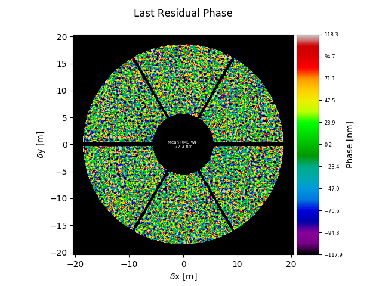

=======================
Residual Phase Analyzer
=======================

Description
===========

:class:`~aosat.analyzers_.phs_analyzer` is actually more a decorative displayer of the last residual phase frame than an actual analyzer.  Nevertheless, it tracks the rms of each input phase frame and computes the mean rms in the end.

Plot caption
============

When called on it's own after :meth:`aosat.analyze.phs_analyze.finalize`, :meth:`aosat.analyze.phs_analyze.make_plot` will produce a plot as follows:

The caption would read:

*Last residual wavefront in nm.  The number in the center gives the time-averaged rms of the residual wavefront.*

Resulting properties
====================

After calling :meth:`aosat.analyze.phs_analyze.finalize`, phs_analyzer will expose the following properties:

.. csv-table:: phs_analyzer properties
  :widths: 1, 3, 5
  :header-rows: 1
  :delim: ;

  Property; type; Explanation
  :attr:`~aosat.analyzers_.phs_analyzer.phs_analyzer.rms`; float ;  mean RMS of all wavefronts in nm.
  :attr:`~aosat.analyzers_.phs_analyzer.phs_analyzer.rmst`; 1D NDarray of length n_frames; individual rms af all residual phase frames in nm
  :attr:`~aosat.analyzers_.phs_analyzer.phs_analyzer.lastphase` ; 2D array; Last residual phasescreen (in nm)
