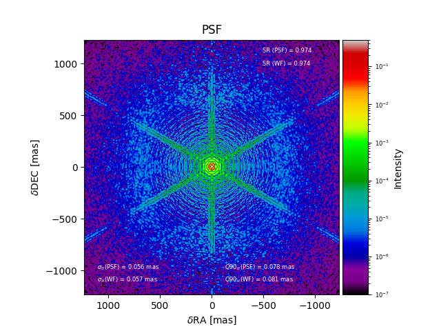

============
PSF Analyzer
============

Description
===========

Analyzing the :abbr:`PSF (Point Spread Function)` is done in a straight forward way: The residual phase of stored in each screen is transformed into a PSF by means of the well known

.. code-block:: python

  np.abs(fftForward(aperture*np.exp(1j*phase)))**2

``aperture`` is represented by the telescope mirror defined in the :doc:`setup file <../general_concept/setup>`.
A number of additional analyses is carried out in the resulting PSF, and the input phase.

* the Strehl ratio is measured on the phase :math:`\phi` as :math:`S = e^{-\sigma_\phi^2}`.
* the Strehl ratio is measured on the PSF as :math:`S = I_{peak}/I_{ref, peak}`, where :math:`I` is the PSF's intensity distribution, and :math:`I_{ref}` is the intensity distribution of a reference PSF resulting from a perfectly flat wavefront.
* The tip and tilt excursion of the PSF is measured on the phase :math:`\phi` by means of a least squares fit of a flat wavefront to the phase
* The tip and tilt excursion of the PSF is measured on the PSF by means of fitting a 2D Gaussian to it.

Plot caption
============

When called on its own, or on a figure with sufficient available subplot space, ``frg_anaylzer.makeplot()`` will produce a figure like so:

The caption for the figure could be:

*Resulting time-averaged PSF in units of peak intensity.  Additionally shown is the Strehl ratio derived from the peak intensity, denoted as "SR(PSF)", and derived from the wavefront quality, denoted as "SR(WF)". The tip-tilt statistics are shown in the lower part, also derived from the PSF directly as well as from the wavefronts.*  :math:`Q_{90}` *means that 90% of TT excursions are smaller than the quoted value.*

Resulting properties
====================

`psf_analyzer` exposes the following properties after :meth:`psf_analyzer.finalize()` has been called:

.. csv-table:: psf_analyzer properties
  :widths: 1, 3, 5
  :header-rows: 1
  :delim: ;

  Property; type; Explanation
  :attr:`~aosat.analyzers_.psf_analyzer.psf_analyzer.psf` ;2D ndarray (float);Time-averaged PSF.
  :attr:`~aosat.analyzers_.psf_analyzer.psf_analyzer.strehl`;float;Strehl ratio of PSF derived from peak intensity.
  :attr:`~aosat.analyzers_.psf_analyzer.psf_analyzer.sr_wf`;float;Strehl ratio of PSF derived from residual wave fronts.
  :attr:`~aosat.analyzers_.psf_analyzer.psf_analyzer.ttx`;1D ndarray (float) of length n_frames;Global tip for each frame from Gauss-fitted PSF location (mas).
  :attr:`~aosat.analyzers_.psf_analyzer.psf_analyzer.tty`;1D ndarray (float) of length n_frames;Global tilt for each frame from Gauss-fitted PSF location (mas).
  :attr:`~aosat.analyzers_.psf_analyzer.psf_analyzer.ttilt`;1D ndarray (float) of length n_frames;Global excursion from centre, determined from wavefront (mas)
  :attr:`~aosat.analyzers_.psf_analyzer.psf_analyzer.ttjit`;float;rms of `ttilt`
  :attr:`~aosat.analyzers_.psf_analyzer.psf_analyzer.ttq90`;float;90% quantile of `ttilt`
  :attr:`~aosat.analyzers_.psf_analyzer.psf_analyzer.ttjit_psf`;float;rms of sqrt(`ttx`**2+`tty`**2)
  :attr:`~aosat.analyzers_.psf_analyzer.psf_analyzer.ttq90_psf`;float;90% quantile of sqrt(`ttx`**2+`tty`**2)
