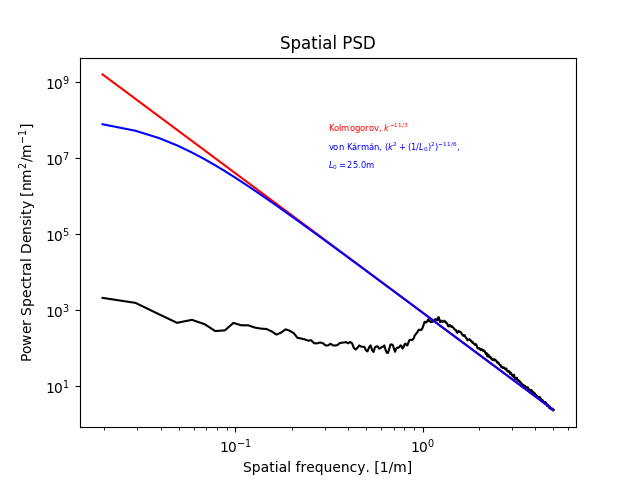

===============================
Spatial Power Spectrum Analyzer
===============================

Description
===========

The power spectrum analyzer derives the time-averaged spatial power spectrum of the residual phase frames.

Anti-aliasing
-------------

The spatial power spectrum is derived by an FFT of the input residual phase:

.. code-block:: python

  fftArray       = np.fft.fftshift(np.fft.fft2(ps*mask,norm='ortho'))
  fftArray       = (fftArray * np.conj(fftArray)).astype(np.float)

The ``mask`` deployed here is an apodized version of the input pupil.  The apodization avoids *ringing*, i.e. the appearance of Airy-ring-like structures in the power spectrum.  Apodization is achieved by modifying the input telescope pupil mask in three steps:

1. transfor it into a pure binary mask
2. apodize the binary mask by applying `skimage.morphology.binary_dilation <https://scikit-image.org/docs/dev/api/skimage.morphology.html#skimage.morphology.binary_dilation>`_ 3 times to derive 3 versions of the pupil, each 1 pixel smaller than the previous one.
3. The 1 pixel wide border region which makes the difference between successively dilated pupils is assigned a transmission value according to a Gaussian fall-off.

  Pupil apodization. Left: crop of the original telescope pupil, in this case of the ELT showing a representation  of the segmentation. Center: Same crop of the pupil after "binarization". Right: Apodized pupil applied to residual phase to avoid aliasing/ringing.

Currently there is no parameter to vary the number of steps for the apodization. In case you absolutely want to, you'd have to assign the mask manually like so:

.. code-block:: python

  >>> import aosat
  >>> nsteps = 6 # let's say you ant 6 steps for a really soft pupil
  >>> a=aosat.analyze.sps_analyzer()
  >>> a.mask = util.apodize_mask(a.sd['tel_mirror'] != 0,steps=nsteps)

The resulting power spectra are averaged azimuthally, and finally temporarily.

Plot captions
=============

When called on its own mode, or on a figure with sufficient available subplot space, ``sps_anaylzer.makeplot()`` will produce a figure like so:

The figure caption would be:

*time-averaged spatial power spectrum of the residual wavefronts.  For comparison, the red line shows the expected open-loop Kolmogorov spectrum. The blue line represents a von Kármán spectrum for an outer scale of* :math:`L_0=25` m.

Note that the blue line is plotted only, when the ``L0`` key is present in the `setup <../general_concept/setup>`_ dictionary

Resulting properties
====================

``sps_analyzer`` exposes the following properties after ``sps_analyzer.finalize()`` has been called:

.. csv-table:: sps_analyzer porperties
  :widths: 1, 3, 5
  :header-rows: 1

  Property, type, Explanation
  **mask**, 2D float NDarray, apodized pupil mask
  **f_spatial** 1D float NDarray, spatial frequency vector [1/m]
  **ps_psd**, 1D float NDarray, Power spectral density at **f_spatial** [nm^2/m^-1]

Note that currently 2D array can be either numpy or a cupy NDarray, depending on whether CUDA support is used or not. When feeding those to other libraries, such as matplotlib, you are advised to use `aosat.util.ensure_numpy(array)`.
