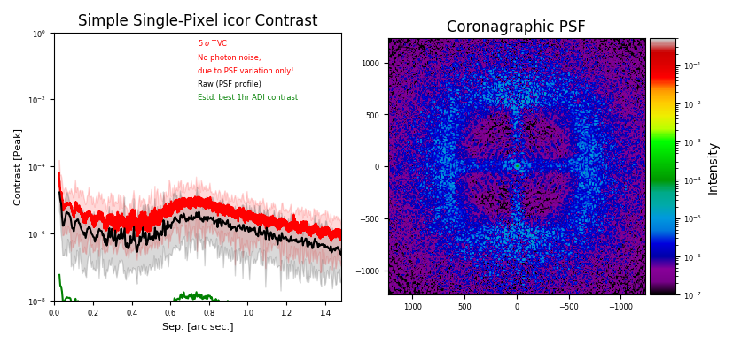

===================================
Temporal Variance Contrast Analyzer
===================================

Description
===========

Motivation
----------

High-contrast performance is one of the prime metrics to judge the quality of closed-loop operation of AO systems these days.  Thus, a contrast curve must not be missing from any decent analysis tearsheet for a give AO simulation.

The prime motivations to come up with :abbr:`TVC (Temporal Variance Contrast)` was the following list of requirements:
Computing the TVC should allow to

1. be able to quickly access the contrast of a large set of simulations (hundreds) that produced a large number of residual WF frames (thousands) each.
2. not have to rely on specific assumptions about position in the sky, amount of field rotation, :abbr:`ADI (Angular Differential Imaging)` algorithm used, etc.
3. assess essentially the impact of a given deterioration of wavefront quality, rather than the precise value.

No. 1 inhibits the use of a full-fledged analysis software like such as `VIP <https://github.com/vortex-exoplanet/VIP>`_ ([GomezGonzales+2017]_ ), which usually runs a couple of hours on each simulation output. We needed something much simpler and faster.

No. 2 fostered the idea of coming up with a measure that attempts a measurement of those limitations that any ADI algorithm would be unable to overcome. This has only partly been achieved, but the underlying thoughts are: Static aberrations cause static PSF patterns, which are easy to handle and cause little or no noise. Aberrations that are de-correlated between frames cause independent realizations of random PSF patterns, these can essentially not be overcome by ADI methods (But instead average out to a certain degree over time). That leaves aberrations that change in intermediate time-scales for the ADI algorithms to handle. These, however, are hardly present in our simulations as we do not simulate :abbr:`NCPA (Non-Common Path Aberrations)` variations, flexure, pupil shifts, or any other slow effect yet.

So in order to measure the fundamental limit imposed by the independent realizations, we came up with the idea of looking at the variance along the temporal axis at each image location separately. This is nicely independent of any assumed amount of field rotation, which would not change these statistics. As variance can be computed in an on-line fashion on focal-plane frames being computed one-by-one subsequently, the method is suitable to operate on very large data sets that can not be held in memory entirely. Since we are not heavily interested in the absolute contrast value, we operate on single pixels only rather than averaging over a certain aperture.

Definition
----------

For this section, we compute a comparison between TVC and a standard ADI contrast. We use a simulation data set from the :abbr:`METIS (Mid-Infrared ELT Imager and Spectrograph)` ([Brandl+2018]_ ) preliminary design phase.

We define two types of contrast to compare, in addition to the actual HCI result. First the TVC. It is computed in the following way:

1. Compute image frames from the residual phases and stack in a cube
2. Compute the variance :math:`V` along the temporal axis for each pixel
3. For a give separation, average the variances over an annulus covering that separation
4. Compute the 5σ contrast for that separation as as :math:`5 \times \sqrt{V}`

In order to have a simplified model for ADI, we compute what we will call the ADI contrast in the following way

1. Compute image frames from the residual phases and stack in a cube
2. Compute a robust mean image along the temporal axis, robust meaning we exclude the 10% of values furthest from the median in each temporal vector.
3. Subtract the above image from each frame
4. Average along the temporal axis
5. For a given separation, compute the variance :math:`V` of pixel values over an annulus covering that separation
6. Compute the 5σ contrast for that separation as as :math:`5 \times \sqrt{V}`

Note that when the assumption works that the temporal variance is a good measure for the variations that cannot be overcome by the ADI algorithm, the TVC contrast and the ADI contrast computed in this way should be related by the square root of the number frames. This is because the ADI procedure averages along the temporal axis, and the error of the mean (found in the spatial standard deviation when ADI contrast is measured) should be given by the temporal standard
deviation divided by the square root of the number of independent realizations.

Comparison to ADI
-----------------

In order to compare the various methods to measure contrast, we computed the TVC and the above simplified ADI model on the same residual phase cube that was used to derive the contrasts in the METIS :abbr:`PDR (Preliminary Design Review)`.

  Contrast curves measured on the standard HCI data set. The green curve is the actual ADI result obtained by running VIP ([GomezGonzales+2017]_ ) on the resulting image cube.
  The straight blue line represents the ADI contrast measured with the method defined in Sec. `Definition`_. The dotted blue line is the same divided by the square root of the number of frames in the cube. The orange curve represents our simplified ADI model, also defined in Sec. `Definition`_.

The above figure shows the contrast curves derived in the various ways. Two observations can be made.
Firstly, the match of the TVC curve divided by the square root of the number of frames to the
contrast curve measured by true ADI via the VIP package is excellent. Note that in the cube used
as input for this experiment is sampled at 300 ms steps, all frames are completely
de-correlated from one another.  ``tvc_analyzer`` tries to determine the correlation length of a given input cube, and divide by the
number of independent realizations instead of the number of frames in order to predict final 1hr ADI contrast. If this determination goes wrong for some reason, results can become unreliable!

The temporal statistics do not vary with time in these simulations - the TVC contrast measured on 500 frames is the same as the one measured on the full set
of 12,000 frames. Thus, if the condition of independent frames and no mid-temporal-frequency being present in the system is granted, the analysis can be greatly accelerated by running only on a subset!

Secondly, the simplified ADI model matches the scaled TVC and the measured ADI curve only partly. While the match in the interesting region around :math:`5λ/D` is reasonable, the curves diverge around the control radius. It is beyond the scope of this comparison to investigate the details of this behaviour.

Impact of wavefront quality
---------------------------

While the prediction of the actual high-contrast performance is nice-to-have, the prime goal of a contrast analysis in AO simulations is to catch all factors that have a pronounced impact on the high-contrast performance of the system.

In order to investigate this, we deteriorated the wavefronts by multiplying residual phase screens with a factor. The impact on contrast at 5λ/D can be seen in
the figure below:

  Evolution of contrast versus wavefront quality.

TVC and modeled ADI contrast as defined in Sec. `Definition`_ behave nicely in parallel. The exact factors found are listed in the table below:

================== ========= ==========
     \             Contrast loss factor
------------------ --------------------
Wavefront rms [nm] ADI model TVC model
================== ========= ==========
91.1               1.00      1.00
96.6               1.10      1.10
111.0              1.21      1.20
115.0              1.31      1.31
129.1              1.42      1.41
137.9              1.52      1.51
141.2              1.63      1.62
151.8              1.74      1.73
157.8              1.85      1.84
162.4              1.97      1.94
================== ========= ==========

TVC appears to be slightly less impacted than the ADI model, but not to the level accuracy used
in this report. We conclude, that we can safely use our TVC analyses to find critical impacts on
contrast caused by the topics under analysis in this report. The impact factors and the resulting
budget should be representative for the full HCI analysis using state of the art ADI algorithms.

tvc_analyzer
------------

``tvc_analyzer`` is different from ost other analyzers in AOSAT as it can run in two distinct mode: Coronagraphic and non-coronagraphic.  Thisis selected during instantiation by means of the ``ctype`` keyword:

.. code-block:: python

  a = tvc_analyzer(ctype='icor') # run with an ideal (perfect) coronagraph inserted
  a = tvc_analyzer(ctype='nocor') # run without coronagraph
  a = tvc_analyzer()              # run without coronagraph

When running in coronagraphic mode, the PSF creation from each residual phase frame is routed through a perfect coronagraph as described in [Cavarroc+2005]_ .
In this case, the incoming complex amplitude :math:`A` (represented as :code:`tel_mirror * exp(1j*phase)`) is modified to :math:`\bar{A} = A - \Pi`, where :math:`\Pi` repreesents the telescope pupil.  The usual factor of a square root of Strehl :math:`\sqrt{S}` is not implemented in ``tvc_analyzer``, as Strehl is either so high that it's negligible, or the determination of :math:`S` is unreliable.  Thus the implementation is :code:`tel_mirror * exp(1j*phase) - tel_mirror`.

In addition, ``tvc_analyzer`` produces an additional plot by default when instantiated in coronagraphic mode:  The coronagraphic PSF.

Plot captions
=============

When called on its own in coronagraphic mode, or on a figure with sufficient available subplot space, ``frg_anaylzer.makeplot()`` will produce two figures like so:

The figure caption for the left image would be :

*Resulting contrast curves.  The black curve shows the PSF profile, the red curve the resulting :math:`5\sigma` contrast from temporal variation of the PSF.
The green curve shows the predicted contrast limit achievable in an integration of 1hr after ADI processing.*

The figure caption for the right image would be :

*Time-averaged coronagraphic PSF. Intensities are relative to the peak of the non-coronagraphic PSF.*

In the non-coronagraphic case,  the right figure is missing.  The green curve is plotted only if a successful determination of the correlation time could be achieved.

Resulting properties
====================

``tvc_analyzer`` exposes the following properties after ``tvc_analyzer.finalize()`` has been called:

.. csv-table:: tvc_analyzer porperties
  :widths: 1, 3, 5
  :header-rows: 1

  Property, type, Explanation
  **ctype**, string, type of coronagraph ("icor" or "nocor")
  **variance2[1]** , 2D float NDarray, time-averaged non-coronagraphic PSF (icor only)
  **contrast**, 1D NDarray, TVC contrast values
  **rcontrast**, 1D NDarray, Raw contrast values (i.e. PSF intensity)
  **mean**  , 2D float NDarray, time-averaged PSF
  **rvec**, 1D float NDarray, radial distances from center for **contrast** and **rcontrast**
  **cvecmean**, 1D float NDarray, Mean TVC contrast averaged over 50 points in **contrast**
  **cvecmin**, 1D float NDarray, Minimum TVC contrast measured over 50 points in **contrast**
  **cvecmax**, 1D float NDarray, Maximum TVC contrast measured over 50 points in **contrast**
  **rvecmean**, 1D float NDarray, Mean raw contrast averaged over 50 points in **rcontrast**
  **rvecmin**, 1D float NDarray, Minimum raw contrast measured over 50 points in **rcontrast**
  **rvecmax**, 1D float NDarray, Maximum raw contrast measured over 50 points in **rcontrast**
  **corrlen**, float, measured correlation length [#frames]
  **max_no_cor**, float, peak intensity of non-coronagraphic PSF

Note that currently 2D array can be either numpy or a cupy NDarray, depending on whether CUDA support is used or not. When feeding those to other libraries, such as matplotlib, you are advised to use `aosat.util.ensure_numpy(array)`.

References
==========

.. [Brandl+2018] SPIE 10702, `Status of the mid-IR ELT imager and spectrograph (METIS) <https://home.strw.leidenuniv.nl/~kenworthy/papers/2018SPIE10702E..1UB.pdf>`_

.. [Cavarroc+2005] A&A 447, 397, `Fundamental limitations on Earth-like planet detection with extremely large telescopes <https://ui.adsabs.harvard.edu/link_gateway/2006A&A...447..397C/arxiv:astro-ph/0509713>`

.. [GomezGonzales+2017] The Astronomical Journal 154(1), `VIP: Vortex Image Processing Package for High-contrast Direct Imaging <https://iopscience.iop.org/article/10.3847/1538-3881/aa73d7>`_
