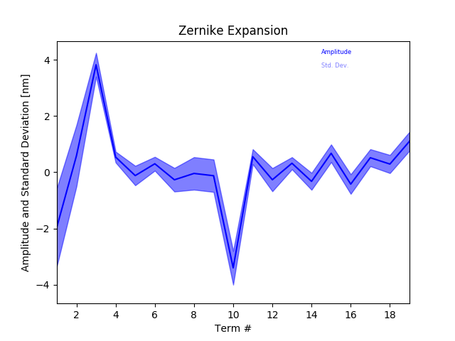

==========================
Zernike Expansion Analyzer
==========================

Description
===========

``zrn_analyzer`` yields the time averaged Zernike expansion of the individual residual phase frames.
The average, and the standard deviation of each term are calculated an presented.

Basis generation
----------------

The number of Zernike term each residual wavefront is expanded into is determined by the ``zterms`` key in the `setup file <../general_concept/setup>`_ .

The function called to set up the basis is `poppy.zernike.arbitrary_basis() <https://poppy-optics.readthedocs.io/en/stable/api/poppy.zernike.arbitrary_basis.html>`.  If you want to set up your own basis to expand wavefronts into, you should create a numpy (cupy) array of shape (d,d,nterms), where :math:`d` is the pupil diameter of your aperture array in ``sd['tel_mirror']`` (see `setup file <../general_concept/setup>`_).  Each plane needs to contain a phase map of the corresponding basis term.  All non-zero pixels in the aperture must be covered by the basis, else the analyzer will crash.  This array should be inserted into the setup dictionary key ``zernike_basis``.

.. code-block:: python

  sd = aosat.analyze.setup()
  sd['zernike_basis'] = my_basis_array
  a = aosat.analyze.zrn_analyzer(sd)

Note the order of these statements which is crucial for the result to be as expected.
Of course your own basis does not necessarily need to be basis of type Zernike.

Wavefront expansion
-------------------

The expansion of individual wavefronts itself is done by :meth:`aosat.util.basis_expand`, which computes the cross-correlations between the wavefront and individual basis terms.

Plot captions
=============

When called on its own, or on a figure with sufficient available subplot space, :meth:`aosat.analyze.frg_anaylzer.makeplot` will produce a figure like so:

The caption would be:

*Time-averaged Zernike expansion of residual wavefronts. The blue line denotes the average amplitude of each term,
the shaded area ranges from the average plus one standard deviation to the average minus one standard deviation.*

reading this documentation you have probably noticed that the zrn_analzer is somewhat mis-labeled as "Zernike" analyzer,
since the functionality to create the basis and to expand the wavefront is actually outside of the analyzer. The only core functionality currently is to restrict the basis choice to Zernike, and produce the plot/report.

If you generated your own basis, you can change the plot title by calling

.. code-block:: python

  a.make_plot(subplotkwargs={"title":"Expansion into my wonderful basis"})

Resulting Properties
====================

:class:`aosat.analyzers_.zrn_analyzer` exposes the following properties after :meth:`aosat.analyzers_.zrn_analyzer.finalize()` has been called:

.. csv-table:: zrn_analyzer properties
  :widths: 1, 3, 5
  :header-rows: 1
  :delim: ;

  Property, type, Explanation
  :attr:`~aosat.analyzers_.zrn_analyzer.zrn_analyzer.modes`; 1D float NDarray of length zterms; Time averaged mean amplitude of each mode
  :attr:`~aosat.analyzers_.zrn_analyzer.zrn_analyzer.dmodes`; 1D float NDarray of length zterms; Standard deviation of each mode amplitude
  :attr:`~aosat.analyzers_.zrn_analyzer.zrn_analyzer.modest`; 2D float NDarray of shape (zterms, nframes);         Individual modal expansion for each frame
