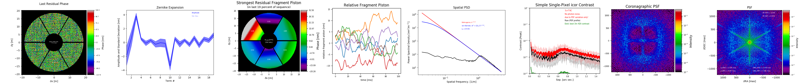

.. image:: https://readthedocs.org/projects/aosat/badge/?version=latest
  :target: https://aosat.readthedocs.io/en/latest/?badge=latest
  :alt: Documentation Status
  :align: right

|

Your favourite AO simulation has terminated, the Strehl ratio is reported at
96.1%, and the world appears to wear all rosy colors. But is it really that good?
What is the contrast that can likely be achieved through angular differential
imaging at 5 λ/D?  How has your system been dealing with pupil fragmentation,
abundant in next generation extremely large telescopes?    What do the spatial
and temporal power spectral densities look like?

To the rescue comes AOSAT, the Adaptive Optics Simulation Analysis Tool(kit).
Run it on the screens containing the residual phase maps and produce either a
tearsheet summarizing all the important information at a single glance, do
in-depth analysis using specialized analyzers, or extend the package to tie it
directly into your simulation code and perform exactly the type scrutiny you require.

|

.. toctree::
  :maxdepth: 2
  :caption: Getting Started

  Installation <getting_started/installation>
  Running the Examples <getting_started/examples>
  A Minimum Setup <getting_started/minimum>

.. toctree::
  :maxdepth: 2
  :caption: General Concept

  Setup Files <general_concept/setup>
  Serving Frames <general_concept/frameserver>
  Analyzers <general_concept/analyzers>

.. toctree::
  :maxdepth: 2
  :caption: Analyzing Phase screens

  Point Spread Function <analyzers/psf_analyzer>
  Pupil Fragmentation  <analyzers/frg_analyzer>
  Zernike Expansion <analyzers/zrn_analyzer>
  Residual Phase <analyzers/phs_analyzer>
  Temporal Variance Contrast <analyzers/tvc_analyzer>
  Spatial Power Spectrum <analyzers/sps_analyzer>

.. toctree::
   :maxdepth: 2
   :caption: Reference

   License <license>
   Authors <authors>
   Changelog <changelog>
   Module Reference <api/modules>

Indices and tables
==================

* :ref:`genindex`
* :ref:`modindex`
* :ref:`search`

.. _toctree: http://www.sphinx-doc.org/en/master/usage/restructuredtext/directives.html
.. _reStructuredText: http://www.sphinx-doc.org/en/master/usage/restructuredtext/basics.html
.. _references: http://www.sphinx-doc.org/en/stable/markup/inline.html
.. _Python domain syntax: http://sphinx-doc.org/domains.html#the-python-domain
.. _Sphinx: http://www.sphinx-doc.org/
.. _Python: http://docs.python.org/
.. _Numpy: http://docs.scipy.org/doc/numpy
.. _SciPy: http://docs.scipy.org/doc/scipy/reference/
.. _matplotlib: https://matplotlib.org/contents.html#
.. _Pandas: http://pandas.pydata.org/pandas-docs/stable
.. _Scikit-Learn: http://scikit-learn.org/stable
.. _autodoc: http://www.sphinx-doc.org/en/stable/ext/autodoc.html
.. _Google style: https://github.com/google/styleguide/blob/gh-pages/pyguide.md#38-comments-and-docstrings
.. _NumPy style: https://numpydoc.readthedocs.io/en/latest/format.html
.. _classical style: http://www.sphinx-doc.org/en/stable/domains.html#info-field-lists
