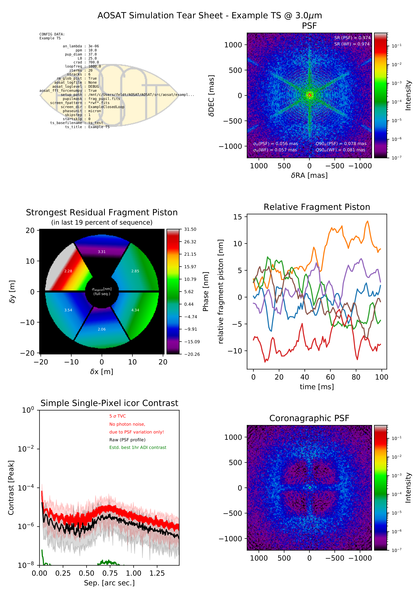

# Summary

Adaptive optics (AO) with its capabilities to correct optical disturbances caused by Earth's
atmosphere in real time is becoming ever more common in astronomy.  Increasingly seen as a
standard facility that supports any type of standard instrumentation, so-called single-conjugate
AO (SCAO) is part of a large number of projects currently in one of their pre-commissioning phases
(@metis; @micado; @harmoni; @nfiraos; @gmt; for an overview see @hippler:2019).  In these phases, the
design of SCAO systems relies heavily on simulations, the typical (SC)AO simulation package [@yao; @compass; @oomao; @caos]
provides a few numbers that characterize the system's performance during the simulation,
plus the residual wavefronts at each time step.  The numbers provided are typically the "Strehl
ratio", a single measure for the quality of an optical image, plus it's variation across wavelengths,
and according to position in the sky.  For modern high-performance instrumentation these numbers
are not sufficient to judge the performance effectively, and a deeper analysis of the residual
wave fronts is required. `AOSAT` provides various possibilities to perform in-depth analyses of
residual wavefronts focusing on different aspects such as (but not limited to)
high-contrast imaging, the impact of fragmented pupils, or non-common path aberrations.
`AOSAT` is on the one hand an integrated tool, capable of providing a summary "tearsheet" of
the system performance in a given simulation, on the other hand built in a modular fashion so
that it can easily be extended with additional "analyzers" focusing on new aspects.

# Statement of need

`AOSAT` is a python package for the analysis of SCAO simulation results. Python is widely used
in the astronomical community these days, and `AOSAT` may be used stand-alone, integrated into
a simulation environment, or can easily be extended according to a user's needs.  Standalone
operation requires the user to provide the residual wavefront frames provided by the SCAO
simulation package used, the aperture mask (pupil) used for the simulation, and a custom setup file
describing the simulation/analysis configuration.  In its standard form, `AOSAT`'s "tearsheet"
functionality will then run all standard analyzers, providing an informative plot collection on
properties such as the point-spread function (PSF) and its quality, residual tip-tilt, the impact
of pupil fragmentation, residual optical aberration modes both static and dynamic, the expected
high-contrast performance of suitable instrumentation with and without coronagraphs, and the power
spectral density of residual wavefront errors. An example output is given in \autoref{fig:tearsheet}.
 To perform such analyses often requires a higher amount of FFT executions than the actual simulation
 package is performing.  To enhance execution speed, `AOSAT`'s analyzers can make use of the `cupy`
 library [@cupy]. If installed, `AOSAT` will perform most array operations on the GPU, which generally leads
 to a speed increase by a factor of 3 to 5.

 

`AOSAT` fills the gap between between the simple numerical outputs provided by most simulation packages,
and the full-scale deployment of instrument simulators and data reduction suites operating on SCAO
residual wavefronts. It enables instrument designers and end-users to quickly judge the impact of design or
configuration decisions on the final performance of down-stream instrumentation.

# History and Evolution

`AOSAT` has been conceived in the course of the development of the SCAO system of *METIS* [@metis; @hippler:2019b]
where it is now the standard tool to evaluate SCAO simulations.  Originally a simple script,
it was decided to switch to a modular design and become independent of the *METIS* and *ELT*
environments.  `AOSAT` accepts the required inputs of residual wavefront frames and
optical aperture masks in a variety of forms (though all must be stored in FITS files [@fits]) and units,
the actual setup described in a dedicated input file.

With its now generalized capabilities, we hope that `AOAT` can be useful to quickly
compare the performance of SCAO supported instrumentation also between different instruments,
and even observatories.  Users are encouraged to add functionality, in particular in the form of
new "analyzer" modules, easily adapted from existing ones.  A planned upgrade for the next version
includes an analyzer for temporal power spectral densities, binned by spatial frequencies.

`AOSAT` includes a frame server that enables the reading and serving of flexible inputs to the analyzers.
It is however possible (and documented!) how this frame server can be circumvented to integrate `AOSAT`
directly in a simulation environment, preferably of course one written in Python.  In this way, the storing
and reading of residual wave fronts to and from files can be skipped, leading to greatly reduced
requirements in terms of disk space while still providing some in-depth analysis.

# Acknowledgements

We acknowledge contributions from Faustine Cantalloube, Olivier Absil, Thomas Bertram, and Horst Steuer.
Many ideas, concepts, and implementation tricks were provided by the above, not to speak of all the feedback given!

# References
